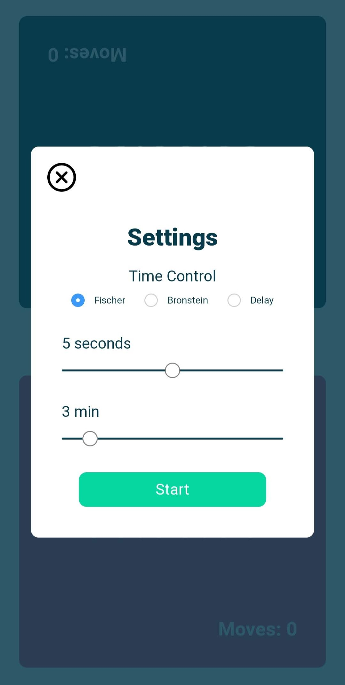
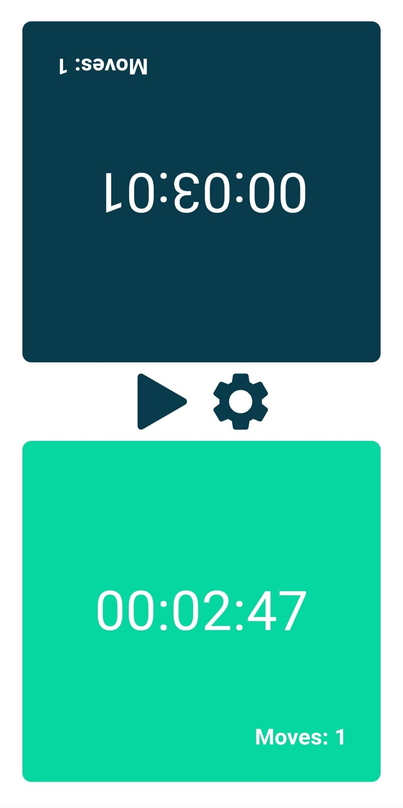

## Chess Clock

An elm pwa implementation of a Chess Clock

[http://chessclock7.surge.sh/](http://chessclock7.surge.sh/)

## Features

[-] Bronstein time control
[-] Fischer time control
[ ] Delay time control
[ ] Multiple stages

